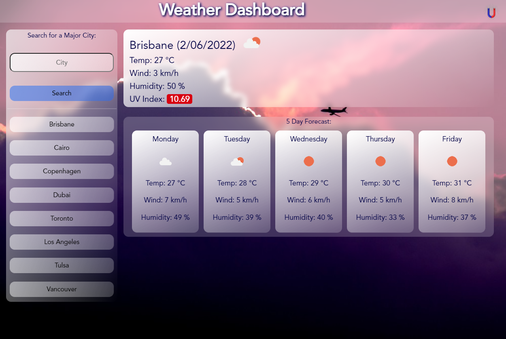

# <Your-Project-Title>Blue Skies Weather Dashboard
## U of T Coding Boot Camp: # 06 Server-Side APIs 
### [Installation](#installation)  - [Usage](#usage)  - [Credits](#credits)  - [License](#license) - [Features](#Features)
&nbsp;
## Description
A simple weather app to get the basic forecast data of major cities and other localities around the world.  The app takes advantage of the OpenWeatherAPI and formats the data for an attractive user experience.

The following is a short description of my experience completing the project:

- Completing this project while working on our group projects demanded some time management practice.
- I did not achieve the results I had hoped for with this project.  The coding was good at times and more brutal than elegant at others.  Still, I tried to keep moving forward without constantly refactoring everything I did before.
- Integrating Boostrap into my design was more troublesome than I anticipated.  I think that I would spend some time studying and familiarizing myself with the CDN if there was a specific need.  However, I find my ability with CSS is better as it is not confused by a lot of unknown styling that Bootstrap offers and I don't yet know about.
- I made the mistake of designing in the first place to achieve the basic layout of the example and found myself challenged to re-style it for a mobile layout.  As a result I did not achieve an attractive and relatively similar responsive design - this was the worst I have done so far.
- I see that I must simply code and code again because there is no telling where I will make mistakes, forget past solutions and devise novel or elegant solutions. ... 10,000 hours they say!

## Installation
To set up the website:
 - upload the index.html, style.css and script.js file along with the assets folder and all of its contents to the host server. 
## Usage
Use this webpage to keep up-to-date on weather around the globe.

[See it online now](https://h0rsesh0e.github.io/blueSkyData/)

## Credits
This is my sixth project in the Coding Boot Camp provided by [The School of Continuing Studies, University of Toronto](https://learn.utoronto.ca/) and [Trilogy Education Services](https://www.trilogyed.com/).  Thanks to my darling for all of her patience as I struggle to learn another new skill.

## License
All content excluding typefaces, registered trade marks and the CC0 licensed background images are the exclusive property of David Baron and or Trilogy Education Services and or The School of Continuing Studies, University of Toronto.

## Features
The application will allow the user to quickly recall upto 8 previous searches and displays as many beautiful images as backgrounds.

&nbsp;

&nbsp;

**H0RSESH0E**
